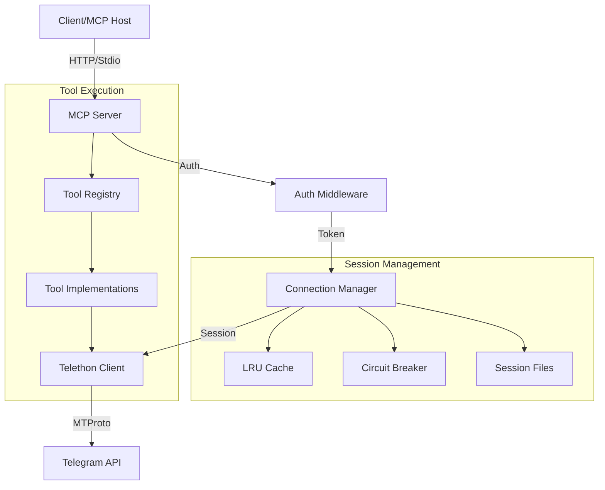

# System Patterns and Architecture

## Architecture Overview

### Modular Design
The project follows a modular architecture with clear separation of concerns:
- `src/server.py`: Entry point, server initialization, and lifecycle management
- `src/config/`: Configuration management (server, setup, logging)
- `src/server_components/`: Core server functionality (auth, routes, tools)
- `src/tools/`: Implementation of MCP tools (messages, contacts, search)
- `src/utils/`: Shared utilities (helpers, logging, error handling)
- `src/client/`: Telegram client connection management

### Connection Management
- **Token-Based Sessions**: Each bearer token corresponds to a unique session file
- **LRU Cache**: `MAX_ACTIVE_SESSIONS` limits concurrent connections (default: 10)
- **Circuit Breaker**: Prevents connection storms by temporarily blocking failing sessions
- **Exponential Backoff**: Intelligent retry logic with increasing delays
- **Self-Healing**: Container restart policy (`unless-stopped`) handles unrecoverable states (e.g., OOM)

### Session Diagnosis Strategy
1. **Health Check First**: Use `/health` endpoint to identify active sessions and failure stats
   ```bash
   curl -s http://localhost:8000/health | jq .
   ```
2. **Isolate Logs**: Filter logs by specific token hash to trace individual session behavior
   ```bash
   docker compose logs | grep "token_hash_prefix"
   ```
3. **Verify timestamps**: Check session file modification times to detect stale vs active sessions
   ```bash
   ls -la --time-style=+%H:%M:%S sessions/
   ```
4. **Correlation**: Match "Wrong Session ID" errors to specific tokens, not just adjacent log lines

## Key Technical Decisions

### FastMCP Integration
- **Stateless HTTP**: Uses `stateless_http=True` for proper auth context handling
- **Decorator Pattern**: `@with_auth_context` ensures bearer token extraction and validation
- **Tool Registration**: Tools are registered dynamically from `src/tools/` modules

### Configuration System
- **Pydantic Settings**: Type-safe configuration from env vars and `.env` files
- **Three Modes**:
  1. `stdio`: Local development, standard input/output
  2. `http-no-auth`: Local HTTP server without auth (dev only)
  3. `http-auth`: Production HTTP server with bearer token auth

### Error Handling
- **Structured Errors**: Unified error response format across all tools
- **Decorator-Based**: `@handle_telegram_errors` provides consistent exception handling
- **Actionable Messages**: Errors include `action` field suggesting user steps (e.g., "authenticate_session")
- **DRY Principle**: Centralized error logic reduces code duplication

## Component Relationships



## Critical Implementation Paths

### Authentication Flow
1. Request arrives with `Authorization: Bearer <token>`
2. `AuthMiddleware` extracts and validates token
3. `ConnectionManager` retrieves/creates session for token
4. `TelegramClient` connects (or reuses cached connection)
5. Request proceeds with authorized client context

### Tool Execution Flow
1. MCP tool request received
2. Parameters validated against type hints
3. `@handle_telegram_errors` wraps execution
4. Tool implementation calls Telegram API
5. Result formatted (JSON-friendly) and returned

### Connection Stability Flow
1. `ensure_connection` called before API usage
2. Check circuit breaker status
3. If closed, attempt connection with backoff
4. If "Wrong Session ID", flag for re-auth (don't retry endlessly)
5. If success, reset failure counters

## Design Patterns

- **Singleton/Registry**: `_singleton_client` (legacy) and `_session_cache` (multi-user)
- **Decorator**: Used for auth context, error handling, and logging
- **Factory**: `get_connected_client` creates/retrieves clients based on context
- **Strategy**: Different auth strategies based on `SERVER_MODE`
- **Circuit Breaker**: Protects system from cascading failures

## Logging Strategy

- **Structured Logging**: Loguru used for consistent, parsable logs
- **Contextual Info**: Request IDs and tokens included in log records
- **Sanitization**: Sensitive data (phone numbers, tokens) masked
- **Level Filtering**: verbose debug logs suppressed in production

## Memory Management
- **Resource Limits**: Docker container limited to 256MB RAM (increased from 128MB)
- **Idle Timeout**: Sessions disconnected after inactivity (planned)
- **Cleanup**: Failed sessions auto-removed to prevent disk bloat
